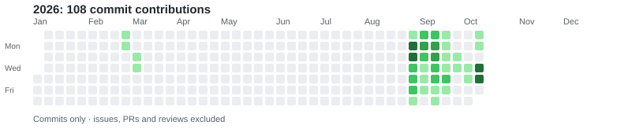
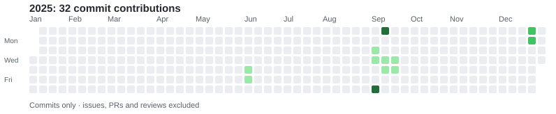
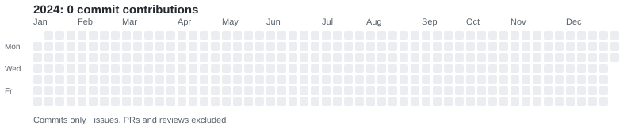
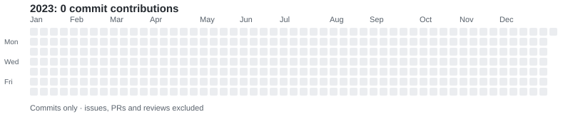
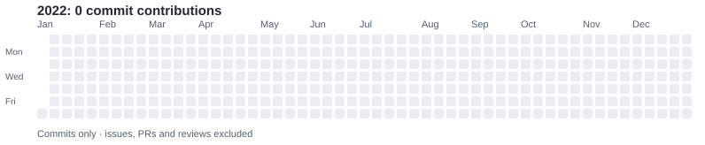
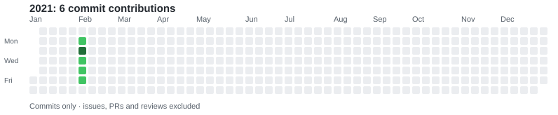
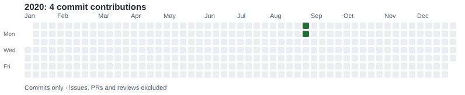

# nica7410

## Commit-only Contributions

Only **commit contributions** are counted here. Issues, pull requests, and reviews are excluded. The figures below are updated daily using GitHub Actions and the GitHub GraphQL API.

<!-- COMMITS_START -->
Daily GitHub-recognized **commit contributions** (issues, PRs and reviews excluded).

<strong>2026</strong> — 108 commits

<strong>2025</strong> — 32 commits

<strong>2024</strong> — 0 commits

<strong>2023</strong> — 0 commits

<strong>2022</strong> — 0 commits

<strong>2021</strong> — 6 commits

<strong>2020</strong> — 4 commits

_Automatically updated daily (UTC). Last update: 2026-10-10._
<!-- COMMITS_END -->

_These are GitHub-recognized commit contributions, not every commit on every branch. The regular GitHub Contributions graph below this README is unchanged._
